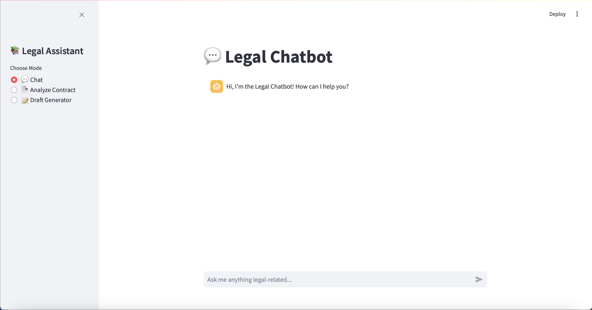

# **LexMind - Legal Chatbot**

---


### New Mind AI Bootcamp Bitirme Projesi

LLM destekli, Neo4j tabanlı, sözleşme analiz, taslak oluşturma ve eksik madde kontrolü yapan legal chatbot projesi.

---

## **Proje Özellikleri**

- Sözleşme maddelerini doğal dilde açıklama
- Eksik ya da zorunlu madde kontrolü
- Benzer maddelerle karşılaştırma ve alternatif öneriler
- Yeni madde önerisi ve tam sözleşme taslağı oluşturma
- LLM destekli akıllı soru-cevap chatbotu
- Neo4j tabanlı Knowledge Graph yapısı
- Embedding tabanlı Semantic Search (OpenAI)
- LangChain agent tabanlı çoklu araç sistemi
- Streamlit ile interaktif kullanıcı arayüzü

---

## **Proje Motivasyonu**

Startup ekosisteminde sıkça kullanılan sözleşmelerin (gizlilik sözleşmeleri, hisse planları, yatırımcı sözleşmeleri, danışmanlık anlaşmaları vb.) hızlı, anlaşılır ve güvenilir bir şekilde analiz edilmesi için tasarlandı.

- Karmaşık hukuki terminolojiyi sadeleştirir.
- Eksik maddeleri tespit eder.
- Alternatif güçlü madde önerileri sunar.
- Tam sözleşme üretimi sağlar.

---

## **Kullanılan Teknolojiler**

- Neo4j: Knowledge Graph tabanlı sözleşme veritabanı
- LangChain: LLM agent yönetimi, Cypher sorgusu üretimi
- OpenAI: ChatGPT (LLM), Embedding (text-embedding-ada-002)
- Streamlit: Web arayüzü
- Python: Veri işleme ve backend kodları
- CUAD Dataset: Clause etiketli sözleşme veri seti

---

## **Veri Modeli**

- **Agreement**: Sözleşme temel bilgileri
- **Clause**: Sözleşmedeki her bir madde
- **ClauseType**: Madde kategorileri
- **Party**: Taraf bilgileri
- **GoverningLaw**: Uygulanan hukuk sistemleri

**İlişkiler:**

```cypher
(:Agreement)-[:HAS_CLAUSE]->(:Clause)
(:Clause)-[:OF_TYPE]->(:ClauseType)
(:Clause)-[:MENTIONS]->(:Party)
(:Clause)-[:UNDER_LAW]->(:GoverningLaw)
```

---

## **Kurulum Adımları**

### **Repository'yi klonlayın**

```bash
git clone <proje-url>
cd legal-chatbot
```

### **Sanal ortam oluşturun**

```bash
python -m venv venv
source venv/bin/activate
```

### **Bağımlılıkları yükleyin**

```bash
pip install -r requirements.txt
```

### **.env dosyasını oluşturun**

```env
OPENAI_API_KEY=sk-xxxxxx
NEO4J_URI=bolt://<NEO4J_IP>:7687
NEO4J_USERNAME=neo4j
NEO4J_PASSWORD=xxxxxx
```

### **Veri yükleme ve graph oluşturma**

```bash
python scripts/create_node.py
python scripts/create_vector.py
```

### **Uygulamayı başlatın**

```bash
streamlit run bot.py
```

---

## **Ekran Görüntüleri**
## 📸 Ekran Görüntüleri


